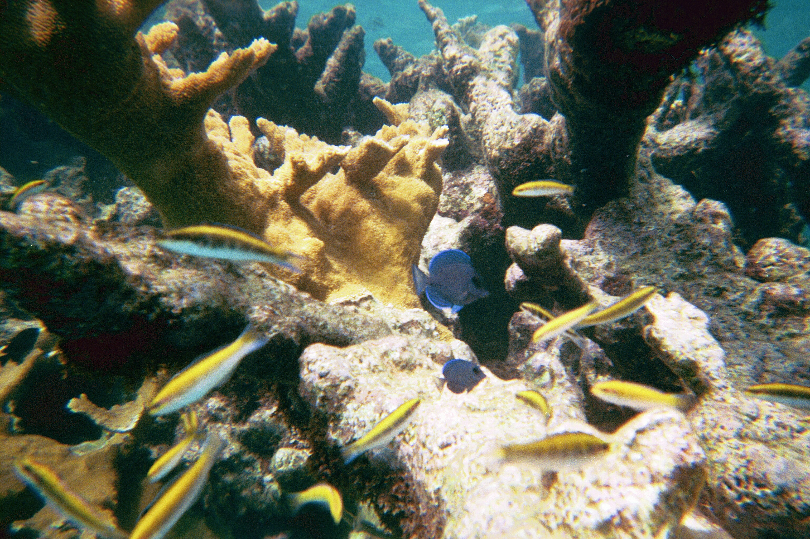

---
execute:
  freeze: auto  # re-render only when source changes
---

> 🚧 **This chapter is under construction. Content may change.**

# Measuring biodiversity across scales

A question that has intrigued ecologists for many decades is how to measure biodiversity. Part of the challenge is that the term biodiversity is an holistic term that can be used as a synonym for "life on Earth" and which can be hard to define in quantitative terms. The Convention on Biological Diversity defines it as "the variability among living organisms from all sources including, *inter alia*, terrestrial, marine and other aquatic ecosystems and the ecological complexes of which they are part; this includes diversity within species, between species and of ecosystems" (Article 2) [@cbd1992]. This definition states that biodiversity has different levels of organization, from the genetic to the ecosystem level, and emphasizes the variability within each level.

alpha, beta, gamma diversity

Figure on coral reefs

## Species-area relationship

## Species abundance distributions

## Estimating diversity indices
