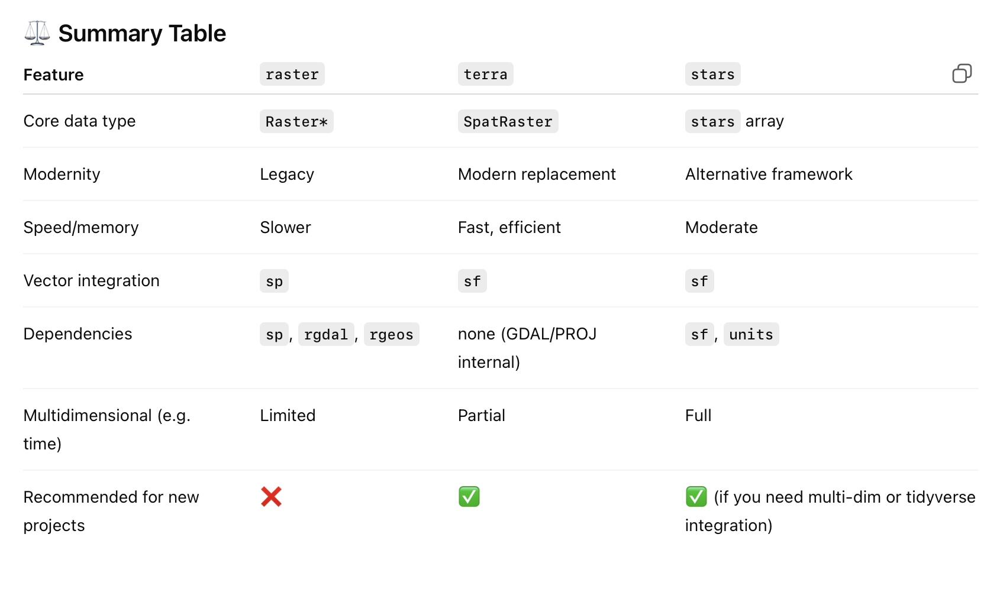

---
execute:
  freeze: auto  # re-render only when source changes
  echo: true
  error: true
---
> 🚧 **This chapter is under construction. Content may change.**
# A brief R tutorial

If you are new to **R** you can have a short dive into its main features by working through this tutorial. If you had learnt programming in another computer language, you will be able to skim over this tutorial to find the main differences from what you have learnt to how things are done in **R.**

## Basic data structures

### Variables

Variables can be any sequence of letter and numbers, but \# it cannot start with a number

```{r}
x = 2
x <- 4
2+2 
y <- x^5
y
```

Please note that you can comment code by using the \# character.

### Vectors

Let's create vectors.

```{r}
# Introduction to vectors
v1 <- c(2,3,6,12)
v2 <- 1:100
length(v2)
v2
v3 <- seq(1,100,5)  # call without naming arguments
v3
v3 <- seq(from=1,to=100,by=5) # call with names of arguments
v3
v3 <- seq(to=100,by=5) # call skipping the first argument
#and using the default value 1 - see help(seq)
v3
v3 <- seq(by=5,to=100) # call by arguments and change order or arguments
```

How to index vectors?

```{r}
# Indexing vectors
v3[3] #uses square brackets to obtain the third element of the vector
v3>20 # produce a vector of boolean values that are TRUE when
      #v3 is greater than 20
v3[v3>20] # select from v3 all the values that are greater than 20
v4<-c(1,2,3,4,5)
v4[c(FALSE,TRUE,FALSE,TRUE,FALSE)] #select from v4 the second and fourth element
v3[1:10] # first ten elements
v3[-1] # dropping first element

head(v2) # prints the first few elements of v2
tail(v2) # prints the last few elements of v2
which(v3 == 26) # returns the position of v3 that equals 26
```

What kind of numerical operations are possible on vectors?

```{r}
2^v2
log(v2)
v5 <- 101:200
v5/v2
```

### Strings

```{r}
#Using strings in R
mystring <- "Ecology"
vstrg <- c("Anna", "Peter", "Xavier")
vstrg[2]
```

### Matrices

```{r}
m <- matrix(5,3,2)
m
m2 <- matrix(1:6,3,2)
m2
t(m2) # transposes matrix

x <- 1:4
y <- 5:8

m3<-cbind(x,y)
m3
m4<-rbind(x,y)
m4

# Indexing matrices
m3[3,2] #element in row 3 and column 2
m3[1,] #entire first row
m3[,1] #entire first column
colnames(m3)<-c("col1","col2")
m3
m3[,"col2"]
```

### Lists

```{r}
# Lists in R
mylist <- list(elem1=m,elem2=v2,elem3="my list")
mylist$elem2
```

### Dataframes

```{r}
# Dataframes
df <- as.data.frame(m3)
df$col1
```

## Basic plots in R

```{r}
#making plots in R
plot(v2,v2)
plot(v2,v2^2)
plot(v2,v2^2,type="l")
plot(v2,v2^2,type="l",col="red")
plot(v2,v2^2,type="l",col="red",main="My beautiful plot")
plot(v2,v2^2,type="l",col="red",main="My beautiful plot",xlab="x",
     ylab="x^2")
lines(v2,v2^3,col="blue")


```

## Iterations and conditional expressions

```{r}
# FOR loops

for (k in 1:10)  # for k =1, 2, 3, 4, 5,...10
  print (k^2)   #do this

R <- 1.2
n <- 1
print(n[1])
for (t in 1:100)
{
  n[t+1] <- R*n[t]
  print(n[t+1])
}


R <- 1.2
n <- 1
for (t in 1:100)
  n[t+1] <- R*n[t]

# IF conditional statement

# logical operators
# == equal to
# > greater than
# < smaller than
# >= greater or equal
# <= smaller or equal
# != different from
# && and
# || or

if (3>2) print ("yes")
if (3==2) print ("yes") else print("no")

if ((3>2)&&(4>5)) print ("yes")

for (k in 1:10)  # for k =1, 2, 3, 4, 5,...10
  if (k^2>20) print (k^2)  
```

## Writing functions

```{r}
# creating FUNCTIONS in r

pythagoras <- function (c1,c2)
{
  h <- sqrt (c1^2 + c2^2)
  return (h)
}

pythagoras(1,1)

pythagoras(5,5)
pythagoras(10,1)

# regression in R

help(lm)
x <- c(1,2,3,4)
y <- c(1.1,2.3,2.9,4.1)
plot(x,y)
myreg<-lm(y ~ x)
summary(myreg)
abline(myreg)
```

## Random numbers and statistical distributions

```{r}

random1d<-function(tmax)
{
x<-0
for (t in 1:tmax)
{
  r<-runif(1)
  if (r<1/2)
    x[t+1]<-x[t]+1 else
      x[t+1]<-x[t]-1
}
return(x)
}

plot(random1d(100))

tmax<-10000
lastx<-0
for (i in 1:1000)
{
  x<-random1d(tmax)
  lastx[i]<-x[tmax]
}

hist(lastx)
mean(lastx)
d<-sqrt(lastx^2)
hist(d)
mean(d)
median(d)
max(d)
hist(d[d<20],breaks=c(1:20))
```

## Intro to apply, pipes, ggplot2, tidyverse

Use of apply instead of for loops.

```{r}
# a recursive function that calculates a factorial
myfun <- function(x)
{
  if (x==1)
    return (1)
  else return(x*myfun(x-1))
}
```

The following does not work

```{r eval=FALSE}
myfun(1:10) # does not work
```

One needs to do a for loop or use apply

```{r}
#option1 - with a for loop
start_time <- Sys.time()
y<-0
for (i in 1:100)
  y[i]<-myfun(i)
end_time <- Sys.time()
end_time-start_time
y

#option 2 - with apply
start_time <- Sys.time()
y<-sapply(1:100,myfun)
end_time <- Sys.time()
end_time-start_time
y
```

Selecting a subset from a matrix and applying a function to a column of that subset

```{r}
Florida <- read.csv("Labs/Florida.csv")

# number of species for year 1970 and route 20
x=tapply(Florida$Abundance,Florida$Route==20 & Florida$Year==1970, length)
#applies length() to Florida$Abundance but by two levels, when the formula is true
#and when the formula is false

# matrix with number of species per route and per year
out<-tapply(Florida$Abundance,list(Florida$Route,Florida$Year), length)

plot(out[10,])

```

```{r}
shannon<-function(x)
{
  p<-x/sum(x)
  - sum(p*log(p))
}

out<-tapply(Florida$Abundance,list(Florida$Route,Florida$Year), shannon)
plot(out[10,])
```

### Working with pipes

```{r}
library(tidyverse)
#our first pipe
x<-rnorm(1000)
hist(x)

rnorm(1000) %>%  hist
```

Now with the Florida data

```{r}
t<-1:ncol(out)

plot(out[10,])
myreg<-lm(out[10,]~t)
summary(myreg)
abline(myreg)

plot(out[10,])
lm(out[10,]~t) %>% summary %>%abline
```

### Using dplyr (tidyverse)

Base R

```{r}
mtcars

# 1. Filter rows where mpg > 20
subset_data <- mtcars[mtcars$mpg > 20, ]

# 2. Select only mpg, cyl, hp columns
subset_data <- subset_data[, c("mpg", "cyl", "hp")]

# 3. Add new column kpg = mpg * 1.6
subset_data$kpg <- subset_data$mpg * 1.6

# 4. Order by descending mpg
subset_data <- subset_data[order(-subset_data$mpg), ]
```

Or

```{r}
subset_data <- subset(mtcars, mpg > 20, select = c(mpg, cyl, hp))
subset_data <- transform(subset_data, kpg = mpg * 1.6)
subset_data <- subset_data[order(-subset_data$mpg), ]
```

Now with tidyverse

```{r}
library(dplyr)

mtcars |>
    filter(mpg > 20) |>
    dplyr::select(mpg, cyl, hp) |>
    mutate(kpg = mpg * 1.6) |>arrange(desc(mpg))
```

Much better with

```{r}
pak::pak("hadley/genzplyr")
library(genzplyr)
mtcars |>
  yeet(mpg > 20) |>
  vibe_check(mpg, cyl, hp) |>
  glow_up(kpg = mpg * 1.6) |>
  slay(desc(mpg))
```

```{r}
# Complete analysis that's absolutely bussin
mtcars |>
  yeet(hp > 100) |>                    # Yeet the weak cars
  vibe_check(mpg, cyl, hp, wt) |>      # Vibe check our columns
  glow_up(                              # Glow up the data
    hp_per_ton = hp / (wt / 2),
    efficiency = mpg / (hp / 100)
  ) |>
  squad_up(cyl) |>                     # Squad up by cylinders
  no_cap(                               # Get the real stats
    avg_hp = mean(hp),
    avg_mpg = mean(mpg),
    avg_efficiency = mean(efficiency),
    squad_size = n()
  ) |>
  disband() |>                         # Disband the squads
  slay(desc(avg_efficiency)) |>        # Sort by slay factor
  send_it(10)     
```

### Introduction to gpplot2

ggplot2 is based on ideas from the book "A grammar of graphics" by Leland Wilkinson and developed by Hadley Wickham, which also developed tidyverse.

```{r ggplot2}
library(ggplot2)

cars
plot(cars$speed,cars$dist)

ggplot(data=cars, mapping=aes(x=speed,y=dist)) + geom_point(colour="red")
```

```{r}
myplot <-  ggplot(cars, aes(speed,dist))+
  geom_point()+geom_line()
myplot

data(cars)
myplot <-  ggplot(cars, aes(speed,dist))+
  geom_point()+geom_smooth(method="lm")
myplot

data(cars)
myplot <-  ggplot(cars, aes(speed,dist))+
  geom_point()+geom_smooth(method="lm")+scale_x_log10()+scale_y_log10()
myplot

```

With tidyplot

```{r}
library(tidyplots)
cars |>  tidyplot(x=speed,y=dist) |>
  add_data_points_beeswarm() |>
  add_curve_fit(method="lm")

cars |>  tidyplot(x=speed,y=dist) |>
  add_data_points_beeswarm() |>
  add_curve_fit()

```

With the florida data

```{r}
#ggplot
mat=cbind(t,out[10,])
colnames(mat)<-c("time","shannon")
mat<-as.data.frame(mat)

myplot <-  ggplot(mat, aes(time,shannon))+
  geom_point()
myplot

myplot <-  ggplot(mat, aes(time,shannon))+
  geom_line()
myplot
```

## Working with biodiversity data: GBIF, EBV Portal

Authors: Corey Callaghan, Luise Quoss, Isabel Rosa.

First we load the library rgbif

```{r eval=FALSE}
library(rgbif)
library(tidyverse)
```

Now we will download observations of a species. Let's download observations of the common toad *Bufo bufo*.

```{r}
matbufobufo<-occ_search(scientificName="Bufo bufo", limit=500, hasCoordinate = TRUE, hasGeospatialIssue = FALSE)
```

Let's examine the object *matbufobufo*

```{r}
class(matbufobufo)
matbufobufo
```

It is a special object of class `gbif` which allows for the metadata and the actual data to all be included, as well as taxonomic hierarchy data, and media metadata. We won't worry too much about the details of this object now.

Let's download data about octupusses. They are in the order "Octopoda". First we need to find the GBIF search key for Octopoda.

```{r}
a<-name_suggest(q="Octopoda",rank="Order")
key<-a$data$key
```

We will only download 2000 observations to keep it simple for now. If you were doing this for real, you would download all data.

```{r}
octopusses<-occ_search(orderKey=key,limit=2000, hasCoordinate = TRUE, hasGeospatialIssue = FALSE)
```

Show the result

```{r}
octmat<-octopusses$data
head(octmat)
```

Count the number of observations per species using tidyverse and pipes

```{r}
octmat %>% 
  group_by(scientificName) %>% 
  summarise(sample_size=n()) %>%
  arrange(desc(sample_size)) %>% 
  mutate(sample_size_log=log(sample_size,2)) %>% 
  ggplot(aes(x = sample_size_log)) + geom_histogram() 
```

Plot the records on an interactive map. First load the leaflet package.

```{r eval=FALSE}
library(leaflet)
leaflet(data=octmat) %>% addTiles() %>%
  addCircleMarkers(lat= ~decimalLatitude, lng = ~decimalLongitude,popup=~scientificName)
```

## Working with raster and shapefiles


