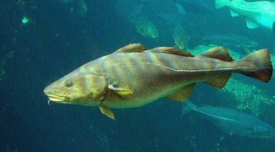

## Managing a fishery

### 1. Consider that you are managing a fishery with the following dynamics:

$$\frac{dn}{dt}=0.2n\left(1-\frac{n}{10000}\right)$$

a\) Plot the production function of the fishery, indicating the stock size at which the maximum sustainable yield occurs and the corresponding production level.

b\) Suppose you establish an annual quota equivalent to 50% of the maximum sustainable yield. What are the two stock-size levels that sustainably allow this exploitation level?

c\) Consider an annual variance of 10% in productivity. Explore what happens when you manage this fishery for 100 years at each of the two stock sizes determined in the previous question.

d\) Explain why, in a system with constant quotas, MSY is not stable and should not be the management goal.

e\) Discuss how these results relate to the paper by Worm et al. (2009) on the need to rebuild fisheries.

```{=html}
<style>
/* Center Quarto/knitr figure captions across themes */
.quarto-figure .figure-caption,
.quarto-figure-center .figure-caption,
.figure .figure-caption,
figure figcaption {
  text-align: center !important;
}
</style>
```

```{r}
#| echo: false
#| fig-cap: "Atlantic cod (*Gadus morhua*)"
#| fig-align: center
#| out-width: 80%

```
