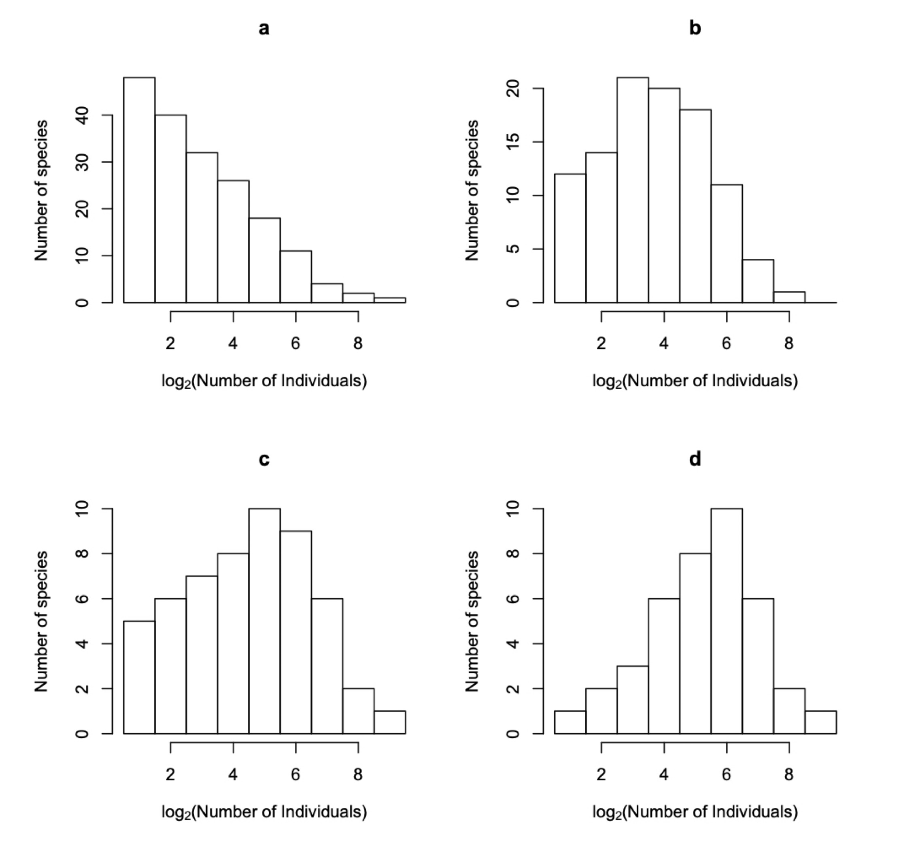

## The unified neutral theory of  biodiversity and biogeography

### 1. Understanding neutral dynamics

a\) The four histograms labeled “a” through “d” represent the species abundance distributions of four local communities, each containing 1,600 individuals. All communities follow the dynamics of the neutral theory under the point mutation speciation model. The corresponding metacommunity is identical for all cases; therefore, the only factor differing among these four local communities is the probability of immigration.

```{=html}
<style>
/* Center Quarto/knitr figure captions across themes */
.quarto-figure .figure-caption,
.quarto-figure-center .figure-caption,
.figure .figure-caption,
figure figcaption {
  text-align: center !important;
}
</style>
```

```{r}
#| echo: false
#| fig-cap: "Species-abundance distributions"
#| fig-align: center
#| out-width: 80%

```

Identify the communities in order of increasing immigration probability and explain your reasoning.

------------------------------------------------------------------------

b\) Draw the logseries (metapopulation SAD) distribution for several values of $\theta$ (e.g., 0.1, 1, 10); assume $x=0.99944$ and $n=1:10000$. Draw the curves in linear-linear, log-linear and log-log scales and discuss the influence of $\theta$ for the shape of the distribution. Recall that the logseries is given by

$$
S=\theta \frac{x^n}{n}
$$

------------------------------------------------------------------------

c\) Using the R function `vallade.houchmandzadeh.eq` plot the S.A.D. for local communities with $J=16,000$ individuals and different values of $\theta$ (e.g., 5, 50) and $m$ (e.g. 0.001, 0.01, 0.1) values. Discuss how different values of $\theta$ and $m$ affect the distribution, and explain why.

*Warnings:*

- The function is slow;

- In some cases (typically for small values of 𝛳) you may get an error message!

```{r}
vallade.houchmandzadeh.eq <- function(J=16000, theta=50, m=0.01){

# vallade.houchmandzadeh.eq integral of Vallade and Houchmandzadeh's equation 
# equivalent to equation 7 of Volkov et al.
# 
# Attention: this function hasn't been fully tested for m=1

### Auxiliary functions:
  
####################################################################

# function der.eq.7
# derivative of equation (15) of Vallade and Houchmandzadeh
# Attention we are using the same variables as Volkov, therefore we need to
# introduce the terms corresponding to the chain of variables:
#	x = mu * w

der.eq.7 <- function(x)
{
   #mu <- m * (J-1) / (1-m) 

# to avoid overflow we work with logs and only convert at the end

   der.equation.7 <- ( log(theta) + cte 
                   + (theta-1)*log(1-x) - log(x) 
                   + log.fract.gamma(n+x*mu, x*mu)
                   + log.fract.gamma(J-n+mu*(1-x), mu*(1-x)) )

   exp(der.equation.7)

}

#######################################################################

# function log.fract.gamma calculates the ln of the fraction with gamma 
#           functions in equation (7)

log.fract.gamma <- function(a, b)
{
  
  inside1 <- function(aa) {
    if(aa <= 1) log(gamma(aa))
    else log.stirling(aa)  
  }
  
  log.num <- sapply(a,inside1) 
  
  inside2 <- function(bb) {
    if(bb <= 1) log.den <- log(gamma(bb))
    else log.den <- log.stirling(bb)
  }
  log.den <- sapply(b,inside2) 
  
  fraction <- log.num - log.den
  
  return(fraction)
}

#######################################################################

# function log.stirling 
# calculates the log of the stirling approximation of the gamma function 

log.stirling <- function(x)
{
   pi <- 3.1415926
   pi.t <- 0.5 * log(2*pi)

   extra <- log(1 + 1/12/x + 1/288/x/x -139/51840/x^3 + 571/2488320/x^4)
   log.st <- -x + (x - 0.5)*log(x) + pi.t + extra
   
   return(log.st)
}

#######################################################################

bin.nospp <- function(data){

# this function bins data assuming that the data is in the format
# line 1 - number of species with one individual 
# line 2 - number of species with two individuals
# line 3 - etc.

        #quartz(width=9,height=7)
        #layout(matrix(c(1,2,3),3,1))

  NN <- 40 	# no of bins
	no.p <- length(data)

  n    <- 1:NN
	bin <- rep(0,NN)
	pow2 <- 2^n

	ini <-  1
  nfin <- trunc(log(no.p)/log(2) + 1)
  for (i in 1:nfin){
		fin <- pow2[i]-1
                if(fin > no.p) fin <- no.p
		bin[i] <- sum(data[ini:fin])
                if(fin > no.p) break
		ini <- fin + 1
	}
	y <- bin[bin>0]
	x <- 1:length(y)

	plot(x, y, xlab=substitute(paste(log[2],"(Number of individuals)",sep="") ),
	                 ylab="Number of species",
                   main="Hubbell's binning method",
                   type="h", lwd=30, lend=1)

  legend("topright",c(paste("J=",J),as.expression(substitute(theta==tt,list(tt=theta))),paste("m=",m)),bty="n")

  lines(x,y,col="red")
}

####### End of auxiliary functions #######

  res.int <- numeric(J)
  J <<- J
  theta <<- theta
  m <<- m

	if(m==1){
		for(i in 1:J){
      f1 <- log.fract.gamma(J+1,J+1-i)
      f2 <- log.fract.gamma(J+theta-i,J+theta)
      res.int[i] <- theta/i*exp(f1+f2)
    }
  }
	else{
    mu <<- m * (J-1) / (1-m) 
    ct1 <- log.fract.gamma(mu, J+mu)

		for(i in 1:J){

      n <<- i
      cte <<- (ct1 + log.fract.gamma(J+1, J-n+1) 
                                     - log.stirling(n+1) )
      res <- integrate(der.eq.7, 0, 1)
      res.int[i] <- res[[1]]
    }
	}

  bin.nospp(res.int)
}

```

------------------------------------------------------------------------

d\) **Extra credit** The exercise is based on <https://hankstevens.github.io/Primer-of-Ecology/diversity.html#neutral-theory-of-biodiversity-and-biogeography>

1\) Install and upload the package `untb`:

```         
install.packages("untb")
library(untb)
```

Read the instructions on the package and briefly describe the information inside it.

------------------------------------------------------------------------

2\)

If you type

```         
a <- untb(start=rep(1:20, 25), prob=0, gens=2500, D=9, keep=TRUE)
```

you will get a matrix, describe the data found in the matrix.

Plot the results to see how the identities change through time at time steps 1, 100, 2500. A single point represents an individual and the different colours represent the different identities, and create the three graphs at the three time points, with the appropriate data, colours, and titles.

------------------------------------------------------------------------

3\) Describe what you obtained in the three previous plots.

------------------------------------------------------------------------

4\) Plot the abundance distribution using the following instructions.

```         
layout(matrix(1:3,ncol=3))

par(mar=c(5,4,1,1))
for(i in times){
plot(as.count(a[i,]),
  ylim=c(1,max(as.count(a[2000,]))), xlim=c(0,20))
}

par(mar=c(6,4,1,3))
out <- lapply(times, function(i)  preston(a[i,]) )
bins <- matrix(0, nrow=3, ncol=length(out[[3]]) )
for(i in 1:3) bins[i,1:length(out[[i]])] <- out[[i]]
#bins

colnames(bins) <- names(preston(a[times[3],]))
for(i in 1:3){
  par(las=2)
  barplot(bins[i,], ylim=c(0,20), xlim=c(0,8), ylab="No. of Species", 
          xlab="Abundance Category" )
}
```

Describe the species rank abundance distributions and the relationship between the number of species and abundance category.

------------------------------------------------------------------------

### References:

Hubbell, S.P. (2001). The Unified Neutral Theory of Biodiversity and Biogeography. Princeton University Press. ISBN 9780691021287.

Rosindell et al (2011). The Unified Neutral Theory of Biodiversity and Biogeography at Age Ten. *Trends in Neutral Ecology & Evolution*, **26(7)**. https://doi.org/10.1016/j.tree.2011.03.024

Stevens, M. H. 2009. A Primer of Ecology with R. First edition. Springer.
