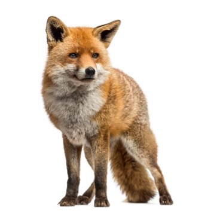

## Road kill

### The ***Red fox***

*…So, while they may be most active at night. Red foxes are especially active during the daytime in **spring and summer (April-Sept)** as they are foraging for food to feed their young. …*

```{=html}
<style>
/* Center Quarto/knitr figure captions across themes */
.quarto-figure .figure-caption,
.quarto-figure-center .figure-caption,
.figure .figure-caption,
figure figcaption {
  text-align: center !important;
}
</style>
```

```{r}
#| echo: false
#| fig-cap: " "
#| fig-align: center
#| out-width: 60%

```

### 1. Install the following R packages:

```         
library(readxl)
library(dplyr)
library(sf)
library(ggplot2) 
library(fuzzySim)
library(grid)
```

### 2. Identify road segments with hotspots

a\) Load the roadkill dataset and explain its structure.

b\) Show that differences in seasonal activity patterns affect the number of red fox–car collisions.

c\) Using the False Discovery Rate (fdr) method, how many hotspots were detected for the active season?

d\) Based on the FDR method, plot the true and “false” hotspots. Explain the general geographic locations of the hotspots and how they vary between the two seasons.

e\) Consider the implications for conservation management.
